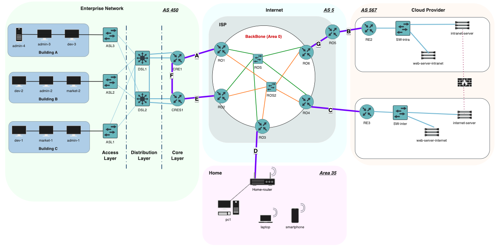

This project simulates a complete **multi-AS network architecture** involving:

- an **Enterprise Network** (Admin, Dev, Marketing)
- an **ISP Backbone** (AS5)
- a **Cloud Provider network** (AS567)
- a **Personal / Remote network**
- dynamic routing (OSPF + BGP)
- redundancy (HSRP, dual uplinks)
- tunnels & NAT
- multi-tier LAN design (access / distribution / core)

It was built and validated entirely in **GNS3**.

------------------------------------------------------------------------

🖥️ Network Topology

------------------------------------------------------------------------

📘 Network Addressing Summary

| Category | Element / Link | Subnet / IP | Notes |
|----------|-----------------|-------------|--------|
| **Enterprise Network (AS450)** | Administrators VLAN | `192.168.10.0/24` | VLAN 10 |
| | Developers VLAN | `192.168.20.0/24` | VLAN 20 |
| | Marketing VLAN | `192.168.30.0/24` | VLAN 30 |
| | Maintenance VLAN | `192.168.99.0/28` | VLAN 99 |
| | Public IP | `223.1.2.136/29` | Enterprise external range |
| **Operator Backbone (AS5)** | ROS1 Backbone | `12.0.0.0/29` | Area 0 |
| | ROS2 Backbone | `12.0.10.0/29` | Area 0 |
| **Personal Network (Area 35)** | Personal Subnet | `192.168.47.0/28` | Home LAN |
| | Gateway | `192.168.47.1` | Home router |
| | Public IP | `12.1.2.3` | User external IP |
| **Cloud Provider (AS567)** | Intranet Subnet | `192.168.60.0/24` | via RE2 |
| | Intranet Gateway | `192.168.60.1` | — |
| | Intra Web Server | `192.168.60.2` | — |
| | Intranet Server | `192.168.60.3` | — |
| | Internet Subnet | `163.173.19.224/28` | via RE3 |
| | Internet Gateway | `163.173.19.225` | — |
| | Internet Web Server | `163.173.19.226` | — |
| | Internet Intranet Server | `163.173.19.227` | — |
| **Point-to-Point Links (A–G)** | Link A | `223.1.2.128/31` | P2P |
| | Link B | `163.173.18.254/31` | P2P |
| | Link C | `163.173.19.222/31` | P2P |
| | Link D | `12.1.2.2/31` | P2P |
| | Link E | `223.1.2.130/31` | P2P |
| | Link F | `172.12.99.0/31` | Area 1 |
| | Link G | `13.0.0.0/31` | Area 10 |

------------------------------------------------------------------------

🎯 Objectives

The main goals of this architecture were:

*1. Replace static routing with dynamic routing*
- OSPF Area 0 for the ISP backbone  
- iBGP + eBGP peering between ASes  
- Controlled redistribution (OSPF ↔ BGP)

*2. Improve interconnection between all networks*
- Enterprise → ISP  
- ISP → Cloud Provider  
- Personal network → ISP → Cloud  

*3. Add redundancy & high availability*
- HSRP for gateway failover  
- Dual uplinks towards ISP  
- Core/distribution/access architecture for LAN

*4. Secure and optimize internal traffic*
- VLAN segmentation  
- NAT boundaries  
- Private tunnels for intranet and remote access

------------------------------------------------------------------------

🧩 Architecture Overview

*Enterprise Network (AS450)*
- 3 floors (Admin, Dev, Marketing)  
- VLAN segmentation per department  
- DHCP, NAT, ACLs  
- Three-tier design:  
  - **Access (ASL1/ASL2/ASL3)**  
  - **Distribution (DSL1/DSL2)**  
  - **Core (CRE1/CRES1)**  
- HSRP for gateway redundancy

*ISP Network (AS5)*
- OSPF Backbone (Area 0)  
- Six core routers (RO1 → RO6)  
- Dual redundant mesh  
- Route redistribution to BGP  
- Public IP allocation

*Cloud Provider (AS567)*
- Public subnet + DMZ  
- Internal services (Web, Intranet)  
- External services (Internet-facing servers)  
- Border routers (RE2/RE3) → eBGP

*Personal Network*
- NAT, DHCP, client testing  
- BGP/OSPF learned routes via ISP

------------------------------------------------------------------------

🔀 Routing Design

*OSPF*
- ISP backbone runs **Area 0**
- Fast convergence  
- Stable neighbor adjacency between all RO* routers  
- LSAs reflect link failure in real time

*BGP*
- **eBGP** between:  
  - Enterprise ↔ ISP  
  - ISP ↔ Cloud Provider  
- **iBGP** inside Cloud AS  
- Path manipulation for preferred routes  
- Public IP advertisements  

*Redistribution*
- OSPF ↔ BGP carefully controlled  
- Avoided loops using filtering + metric tuning  

------------------------------------------------------------------------

🌐 Services & Features

*✔ VLANs & Inter-VLAN routing*
Each department has its own subnet.

*✔ HSRP*
Provides gateway redundancy for LAN clients.

*✔ NAT*
- NAT overload for enterprise private addresses  
- Public NAT for Cloud web services  

*✔ Tunnels*
Encrypted tunnels used for intranet access and remote work.

*✔ DHCP*
Automatic addressing in enterprise floors.

*✔ ACLs*
Traffic filtering between departments + WAN access.

------------------------------------------------------------------------

🛠️ Testing & Validation

The following scenarios were tested:

🔹 link failure → path convergence via OSPF  
🔹 BGP peer failure → fallback path  
🔹 failover between HSRP primary/standby  
🔹 Cloud service reachability tests  
🔹 VLAN isolation & inter-VLAN routing  
🔹 NAT validation (inside → outside)  
🔹 tunnel connectivity checks  

All tests were performed using:

- **VPCS clients**  
- **Debian VMs**  
- **PING, TRACEROUTE, IPERF**  
- **GNS3 packet captures**

------------------------------------------------------------------------

📚 What I Learned

- Designing real-world multi-AS architectures  
- Understanding redistribution pitfalls  
- Implementing high availability with HSRP  
- Tuning BGP & OSPF for predictable failover  
- VLAN design for multi-floor enterprise networks  
- Cloud/ISP interconnect logic  
- Managing complexity in large topologies  

------------------------------------------------------------------------

If you want to explore all configurations, scenarios, and diagrams:  
👉 **Full project root folder**

